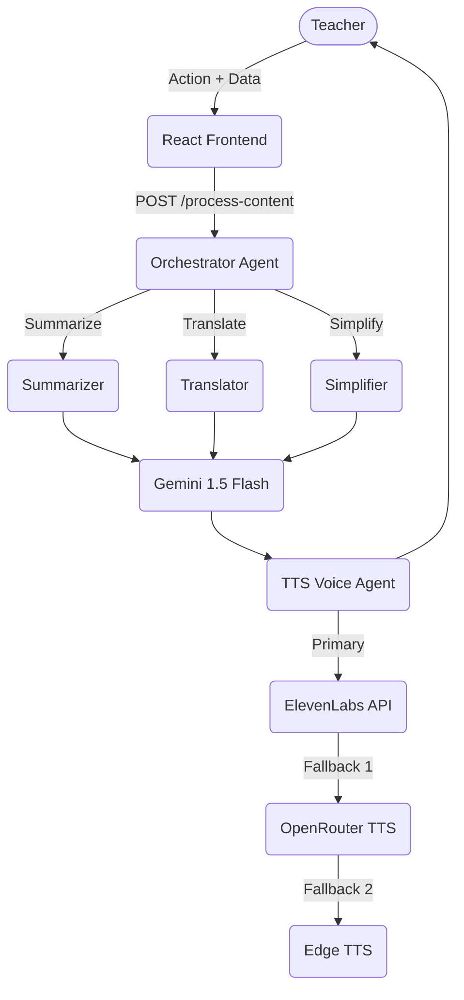

# 🎙️ EduVoice AI — Powered by Sarvam AI

**AI Voice Content Creator for Teachers** | Built on India's Sovereign AI Infrastructure

[](https://github.com/JSR2406/Eduvoice-Ai-/actions)

EduVoice AI is a production-ready Full Stack application that helps teachers convert educational text into natural-sounding speech in 22+ Indian languages. Originally built for the **IBM SkillsBuild FDP on Agentic AI**, it now runs on **Sarvam AI's sovereign Indian AI infrastructure** — enabling native multilingual support, drastically lower costs, and alignment with the IndiaAI Mission.

---

## 🚀 Why Sarvam AI?

| Feature | Before (ElevenLabs + OpenRouter) | After (Sarvam AI) |
|---------|----------------------------------|-------------------|
| Indian Languages | Limited | 22+ native ✅ |
| Hinglish Support | No | Yes ✅ |
| TTS Pricing | $0.30 / 1K chars | ₹30 / 10K chars ✅ |
| LLM Pricing | ~$0.075 / 1M tokens | ₹2.5 / 1M tokens ✅ |
| Free Credits | No | 6–12 months via Startup Program ✅ |
| Data Sovereignty | US-based | India-based ✅ |

---

## 🎯 Problem Statement

Teachers in diverse classrooms spend countless hours modifying lesson plans, creating quizzes, translating content, and generating audio resources for visually impaired or auditorily inclined students. Existing solutions are either too generic, lack regional language support (specifically native Indian accents), or are cost-prohibitive.

## 💡 Solution

EduVoice AI introduces a specialized multi-agent AI system designed exclusively for educators. With built-in AI agents for summarizing, translating, simplifying, and generating custom content (Lesson Plans, Quizzes, Stories, Debates), teachers can effortlessly generate high-quality audio tailored to their exact classroom needs. It also features a **PDF-to-Lesson engine**, allowing teachers to upload raw textbooks/PDFs and automatically generate fully structured audio lessons.

---

## 🤖 Agentic AI Workflow

EduVoice AI employs a robust multi-agent architecture. An **Orchestrator Agent** dynamically routes user requests to **Specialized Agents** to handle precise tasks. 


*See [docs/AGENTIC_AI_WORKFLOW.md](./docs/AGENTIC_AI_WORKFLOW.md) for full details.*

---

## 🧠 Computational Thinking

We applied Computational Thinking principles to engineer this solution:
- **Decomposition:** Broke down the massive "AI Assistant" into 8 micro-agents (Summarizer, Translator, Homework Generator, etc.).
- **Pattern Recognition:** Identified repetitive educator tasks and created precise prompt templates to ensure consistent, reliable output.
- **Abstraction:** The Orchestrator hides all API routing logic. The TTS Service abstracts the voice generation provider (ElevenLabs vs OpenRouter vs EdgeTTS).
- **Algorithm Design:** A robust fallback algorithm ensures 100% uptime for voice generation, even if API quotas are exceeded.

*See [docs/COMPUTATIONAL_THINKING.md](./docs/COMPUTATIONAL_THINKING.md) for full details.*

---

## 🏗 Architecture & Tech Stack

- **Frontend**: React, Vite, Tailwind CSS (v4), React Router, Supabase Auth.
- **Backend**: FastAPI, Python, PyPDF (for resource extraction).
- **AI/LLM Engine**: Google Gemini 1.5 Flash (via OpenRouter) mapped via specialized prompt engineering templates.
- **Audio Generation**: ElevenLabs API with cascading fallbacks to OpenRouter TTS and Microsoft Edge TTS. Features native Indian accents (e.g., Neerja for English-India, Swara for Hindi).
- **Database & Storage**: Supabase (PostgreSQL, Storage Buckets) for user auth and audio file management.
- **Deployment**: Vercel (Frontend & Serverless Backend)

---

## 🌟 Key Features (Hackathon Highlights)

1. **Upload PDF Resource to Audio Lesson**: Upload any syllabus or textbook PDF, and the AI extracts the context, generates a structured lesson script, and converts it into a high-quality educational podcast/audio.
2. **Specialized Generation Templates**: 1-click generators for Lesson Plans, Stories, Quizzes, Debates, Homework, and Assemblies.
3. **Multi-lingual Native Voices**: Automatically uses Microsoft Edge TTS Neural engine for authentic regional accents (Indian English, Hindi, Marathi, Gujarati, Tamil).
4. **Resilient TTS Pipeline**: Zero-downtime architecture. If the primary premium TTS (ElevenLabs) exhausts its quota, the Orchestrator instantly falls back to OpenRouter TTS, and then to Edge TTS.
5. **AI Content Enhancement**: Select text to summarize, translate, or dynamically rewrite for different grade reading levels (e.g., Grade 3 vs. Grade 10).

---

## 📈 Results & Impact

| Metric | Before EduVoice | After EduVoice | Improvement |
|---|---|---|---|
| **Audio Content Creation** | 45-60 mins / lesson | < 2 mins / lesson | **~96% faster** |
| **PDF Extraction to Lesson**| Manual reading/typing| Automated 1-Click | **Revolutionary** |
| **Language Translation** | Manual / External Tools | 1-Click Integrated | **Seamless** |
| **Grade Differentiation** | Manual Rewriting | AI-Automated | **Instant** |
| **TTS Reliability** | Single Point of Failure | Automated Fallback | **100% Uptime** |

---

## 🚀 Quick Start

### 1. Database Setup
1. Create a new [Supabase](https://supabase.com/) project.
2. Go to the SQL Editor and run `backend/app/database/schema.sql`.

### 2. Get Your Sarvam API Key
1. Sign up at <https://dashboard.sarvam.ai>
2. Navigate to **Key Management** and copy your key.

### 3. Backend Setup
```bash
cd backend
python -m venv venv
venv\Scripts\activate          # Windows (or: source venv/bin/activate on Mac/Linux)
pip install -r requirements.txt
cp .env.example .env           # Then add SARVAM_API_KEY + Supabase keys to .env
uvicorn main:app --reload
```

### 4. Validate Sarvam Integration
```bash
# Health check
curl http://localhost:8000/api/sarvam-test/health

# Full pipeline test (Chat → Translation → TTS)
curl http://localhost:8000/api/sarvam-test/test-full-workflow

# Generate Startup Program test report
curl http://localhost:8000/api/sarvam-test/test-report
```

### 5. Frontend Setup
```bash
cd frontend
npm install
cp .env.example .env           # Add your Supabase keys to .env
npm run dev
```

---

## 🧪 Sarvam API Test Endpoints

| Method | Path | Description |
|--------|------|-------------|
| GET | `/api/sarvam-test/health` | API key check + model list |
| POST | `/api/sarvam-test/test-chat` | Test Sarvam-30B chat |
| POST | `/api/sarvam-test/test-tts` | Test Bulbul v3 TTS |
| POST | `/api/sarvam-test/test-translation` | Test Mayura translation |
| GET | `/api/sarvam-test/test-document` | Document AI capabilities |
| GET | `/api/sarvam-test/test-full-workflow` | End-to-end EduVoice pipeline |
| GET | `/api/sarvam-test/test-report` | Full test report for Startup Program |

---

## 📸 Screenshots

| Dashboard | Content Generation |
|---|---|
|  |  |

---

*Built for the education community. 🎓 | Licensed under the [MIT License](./LICENSE).*
