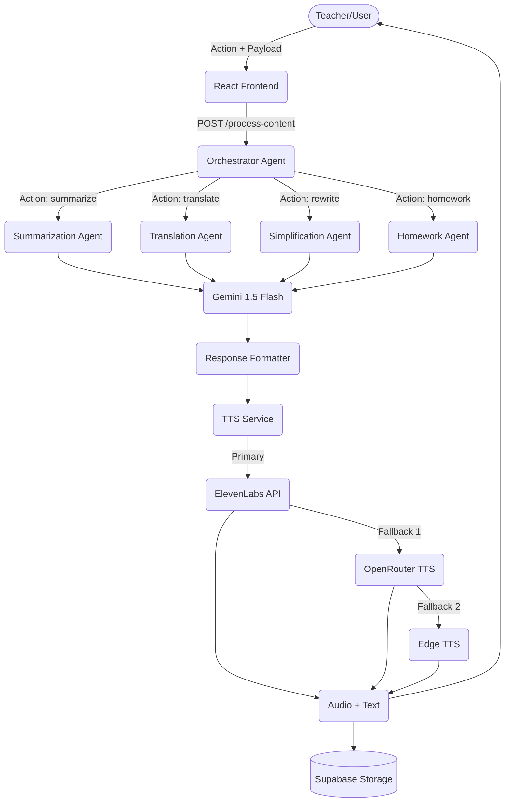

# Agentic AI Workflow

EduVoice AI utilizes a multi-agent system to handle complex educational tasks efficiently. Instead of a single, monolithic LLM prompt, we employ an Orchestrator Agent that routes tasks to Specialized Agents.

## Architecture Diagram

## Agent Roles

1. **Orchestrator Agent (`backend/app/services/orchestrator.py`)**
   - The central decision-maker. Receives the requested action, validates the payload, and delegates to the appropriate specialized agent.
2. **Specialized Agents (`backend/app/services/gemini_service.py`)**
   - Each agent has a distinct, narrow focus and uses specific, optimized prompts loaded from the `prompts/` directory.
3. **TTS Service / Voice Agent (`backend/app/services/tts_service.py`)**
   - Handles the conversion of text to speech, actively managing fallback scenarios to ensure high reliability.
